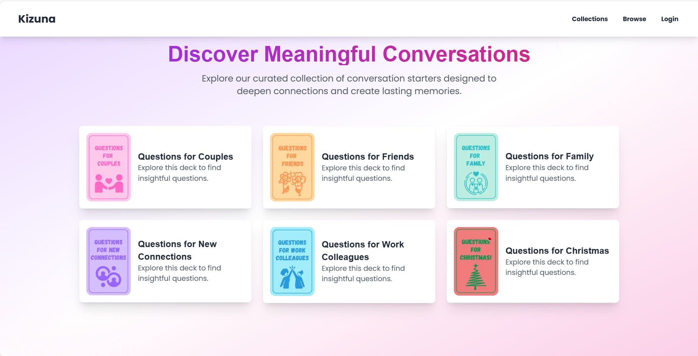

# Kizuna Cards

## Overview

Kizuna Cards is a web application built with Next.js that helps people explore engaging questions to deepen their relationships and understanding. It offers a collection of themed decks with insightful questions that can be browsed and shared between people.

## Features

* Interactive Navbar: Access different sections like Collections, Browse, and Login seamlessly through an intuitive navigation interface designed for ease of use.

* Responsive Design: Experience consistent functionality and appearance across all devices, from mobile phones to desktop computers, ensuring a smooth user experience.

* Personalized Decks: Choose from a variety of carefully curated themed decks, including Family, Christmas, and other special topics to spark meaningful conversations.

* Subscription Management: Access premium features and exclusive content through our flexible subscription system, designed to provide additional value to committed users.

* Password Recovery: Maintain secure access to your account with our streamlined password recovery process, ensuring you never lose access to your saved content.

* Authentication with NextAuth.js: Enjoy secure user management and login functionality powered by industry-standard authentication protocols.

## Tech Stack

### Frontend
* React
* Next.js
* Tailwind CSS

### Backend
* Node.js
* MongoDB

### Additional Libraries
* Nodemailer for email services